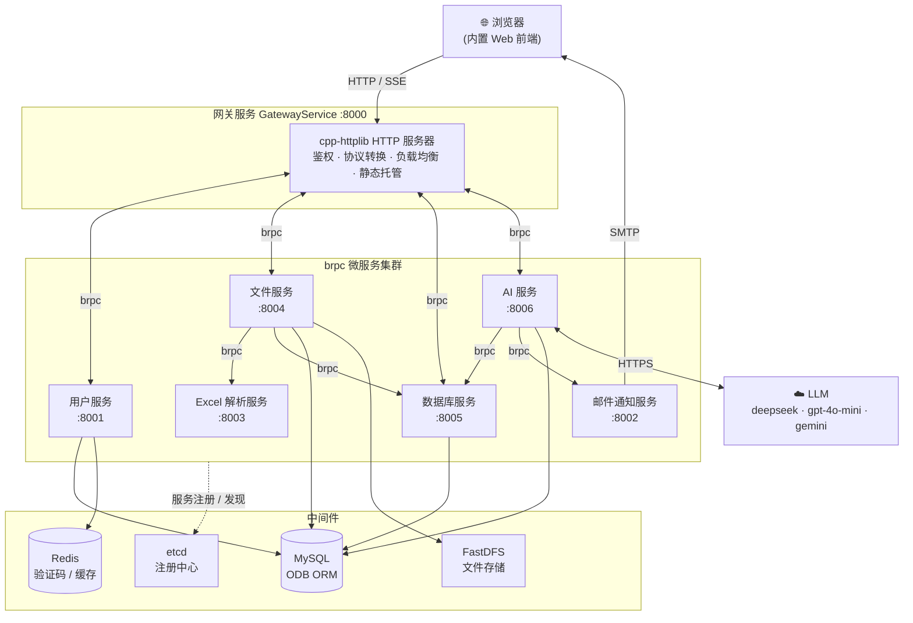

<div align="center">


# ChatExcel

**用自然语言驾驭 Excel 与数据库 —— 让没有技术背景的人也能高效处理复杂数据**

基于 C++20 微服务架构的智能数据对话平台（LLM × Data Analytics）

[](https://en.cppreference.com/) [](https://cmake.org/) [](https://github.com/apache/brpc) [](https://www.docker.com/) [](./LICENSE) [](https://github.com/CaiFuLei007/chat-excel/pulls)

[快速开始](#-快速开始-quick-start) · [API 文档](docs/API.md) · [架构设计](docs/ARCHITECTURE.md) · [在线体验](#-效果预览)

</div>

---

## 目录

- [ChatExcel](#chatexcel)
  - [目录](#目录)
  - [📖 项目简介（Introduction）](#-项目简介introduction)
    - [背景与痛点](#背景与痛点)
    - [本项目的解决方案](#本项目的解决方案)
    - [适用场景](#适用场景)
    - [效果预览](#效果预览)
  - [✨ 核心特性（Features）](#-核心特性features)
  - [🧰 技术栈与环境要求（Tech Stack \& Requirements）](#-技术栈与环境要求tech-stack--requirements)
    - [🔩 自研基础库](#-自研基础库)
      - [cpp-toolkit — 轻量级 C++ 系统编程工具集](#cpp-toolkit--轻量级-c-系统编程工具集)
      - [AIChat-sdk — 多模型 AI 对话服务](#aichat-sdk--多模型-ai-对话服务)
  - [🚀 快速开始（Quick Start）](#-快速开始quick-start)
    - [1. 前置条件](#1-前置条件)
    - [2. 克隆项目](#2-克隆项目)
    - [3. 构建项目（本地编译）](#3-构建项目本地编译)
    - [4. 环境变量配置](#4-环境变量配置)
    - [5. 启动服务（Docker Compose 一键启动）](#5-启动服务docker-compose-一键启动)
    - [6. 生产构建（自定义镜像）](#6-生产构建自定义镜像)
  - [💡 用法示例（Usage Examples）](#-用法示例usage-examples)
    - [示例 1：注册 → 登录 → 获取会话](#示例-1注册--登录--获取会话)
    - [示例 2：上传 Excel 并流式对话](#示例-2上传-excel-并流式对话)
  - [📚 API 参考（API Reference）](#-api-参考api-reference)
  - [🏛️ 项目架构（Architecture）](#️-项目架构architecture)
  - [🛠️ 开发指南（Development Guide）](#️-开发指南development-guide)
    - [目录结构](#目录结构)
    - [运行单元测试](#运行单元测试)
    - [代码风格](#代码风格)
    - [提交规范](#提交规范)
  - [🐳 部署运维（Deployment \& Ops）](#-部署运维deployment--ops)
    - [镜像构建与运行](#镜像构建与运行)
    - [Docker Compose 部署](#docker-compose-部署)
    - [环境变量说明（生产环境注意事项）](#环境变量说明生产环境注意事项)
  - [License](#license)

---

## 📖 项目简介（Introduction）

### 背景与痛点

传统的数据分析流程中，业务人员面对 Excel 表格或数据库时，常常会遇到这些障碍：

- **不会写 SQL**：想从几万行数据里"统计各区域销售额"，却卡在写查询语句这一步；
- **Excel 函数门槛高**：VLOOKUP、数据透视表对非技术用户并不友好，复杂分析难以落地；
- **工具割裂**：数据分散在本地 Excel、MySQL、SQLite 等多种数据源之间，来回切换成本高；
- **结果难以表达**：分析完成后，把结论整理成图表或报告仍需手工操作。

### 本项目的解决方案

ChatExcel 将 **LLM（大语言模型）** 与 **数据分析** 深度结合：用户只需上传数据文件或连接数据库，然后用一句自然语言提问，系统即可自动完成 **意图理解 → SQL 生成 → 数据查询 → 结果总结 → 可视化呈现** 的完整链路，并以 **SSE 流式响应** 实时推送分析过程。

整体采用 **C++ 微服务架构** 拆分为 7 个独立子服务（网关 / 用户 / 文件 / Excel 解析 / 数据库 / AI / 通知），通过 etcd 做服务发现、brpc 做服务间通信，具备工业级后端的完整技术形态。

### 适用场景

- 想用对话方式分析 Excel 报表、无需掌握函数与透视表的业务人员；
- 需要对 MySQL / SQLite 数据源做自然语言查询与可视化的团队；
- 正在学习 **C++ 微服务架构**（服务发现、RPC、ORM、分布式文件系统、SSE 流式推送）的开发者；
- 需要一套可参考的 **LLM 工程化落地** 后端实现（提示词模板、两阶段 SQL 生成、SQL 安全校验）的技术团队。

### 效果预览

启动服务后，浏览器访问网关入口（默认 [http://localhost:8000](http://localhost:8000)）即可打开内置 Web 端：

- **首页**：项目介绍与功能演示；
- **登录页**：支持昵称密码 / 邮箱验证码两种登录方式；
- **控制台**：文件上传、Excel 预览、数据库连接、流式对话与 ECharts 图表渲染。


---

## ✨ 核心特性（Features）

- 🗣️ **自然语言驱动数据分析**：上传 Excel（`.xlsx`）或连接 MySQL / SQLite 后，一句话提问即自动生成 SQL 并执行，返回"标题 → 任务分解 → 分析思路 → SQL → 总结 + 可视化"的完整结构化结果。

- 🔀 **SSE 流式响应**：AI 分析过程通过 Server-Sent Events 逐段推送，用户无需等待全部分析完成即可看到阶段性输出，体验接近主流 AI 对话产品。

- 🏗️ **完整微服务架构**：7 个子服务各司其职，基于 **etcd 注册中心** 做服务发现、**brpc** 做高性能服务间调用、**FastDFS** 分布式文件系统存储上传文件，网关内置鉴权、协议转换与负载均衡。

- 🛡️ **SQL 安全防护**：内置 SQLValidator 校验器 —— 危险操作关键字检测（大小写不敏感、词边界匹配）、SQL 注入防护、多语句拦截；修改类 SQL 不直接操作原表，而是复制临时表执行，保护原始数据。

- 🤖 **多模型热切换**：通过 JSON 配置接入 deepseek-chat、gpt-4o-mini、gemini-flash-2.0 等云端模型，无需改代码即可扩展模型列表，支持按会话选择模型。

- 📦 **开箱即用的 Web 前端**：网关直接托管内置 Web 站点（登录 / 控制台 / 数据预览 / ECharts 可视化），克隆 + 部署后浏览器即可使用，无需单独开发前端。

---

## 🧰 技术栈与环境要求（Tech Stack & Requirements）

| 类别 | 技术 / 组件 | 版本要求 | 用途 |
| --- | --- | --- | --- |
| 语言 | C++ | ≥ 20（`std::jthread` 等特性） | 全部业务代码 |
| 构建 | CMake | ≥ 3.10 | 构建系统 |
| 基础环境 | Ubuntu | 24.04（Docker 镜像基座） | 推荐 Linux 平台 |
| RPC 框架 | brpc | — | 服务间高性能通信 |
| 序列化 | protobuf (proto3) | — | RPC 接口定义与消息序列化 |
| 服务发现 | etcd + etcd-cpp-apiv3 | ≥ 3.6 | 注册中心 / 服务发现 |
| HTTP 服务 | cpp-httplib | — | 网关 HTTP 服务器（30 个接口） |
| ORM | ODB | — | MySQL 数据实体映射 |
| 数据库 | MySQL | ≥ 5.7 | 用户 / 文件 / 会话等持久化存储 |
| 缓存 | Redis + redis-plus-plus | — | 验证码存储、用户信息旁路缓存 |
| 文件存储 | FastDFS | — | Excel / SQLite 文件分布式存储 |
| Excel 解析 | OpenXLSX | — | 解析 xlsx 的 worksheet 结构与数据 |
| AI SDK | [AIChat-sdk](https://github.com/CaiFuLei007/AIChat-sdk) ⭐ 自研 | C++20 | 多模型 LLM 对话 SDK（[见下文介绍](#-自研基础库)） |
| 公共脚手架 | [cpp-toolkit](https://github.com/CaiFuLei007/cpp-toolkit) ⭐ 自研 | — | 日志 / RPC 信道管理 / 服务发现等封装（[见下文介绍](#-自研基础库)） |
| 命令行 | gflags | — | 参数解析（支持配置文件） |
| 日志 | spdlog | — | 异步日志 |
| JSON | JsonCpp | — | 请求 / 响应序列化 |
| 单元测试 | GoogleTest + CTest | — | 数据层 / 业务层 / RPC 层测试 |
| 容器化 | Docker + Docker Compose | — | 构建镜像与编排 7 个子服务 |

### 🔩 自研基础库

本项目构建在两个独立开源的自研库之上，与本项目同为 Apache-2.0 协议，均可单独复用于其他 C++ 项目：

#### [cpp-toolkit](https://github.com/CaiFuLei007/cpp-toolkit) — 轻量级 C++ 系统编程工具集

微服务基础设施的公共脚手架，对常用组件做了统一封装，本项目全部 7 个子服务的日志、RPC 信道管理与服务发现均由它驱动：

- **RPC 信道管理（ChannelManager）**：封装 brpc，提供服务信道管理与轮询负载均衡；
- **服务发现**：基于 etcd-cpp-apiv3 封装服务注册与节点上下线监控；
- **FastDFS 客户端**：基于 libfdfsclient 的 C++ 封装（FdfsClient），直接走 FastDFS 私有协议；
- **日志（Logger）**：封装 spdlog，异步输出，不阻塞业务线程；
- **Redis（RedisFactory）**：封装 redis-plus-plus，配置化创建连接；
- **JsonUtil** 等工具组件：JSON 序列化 / 反序列化等通用能力。

#### [AIChat-sdk](https://github.com/CaiFuLei007/AIChat-sdk) — 多模型 AI 对话服务

基于 C++20 的多模型 LLM 对话 SDK，本项目的 AI 子服务通过它与各家大模型交互：

- **Provider 抽象**：统一模型适配接口，内置 DeepSeek / ChatGPT / Gemini 三家 Provider，新增模型只需继承实现；
- **会话与消息管理**：SessionManager 管理会话，SQLite 持久化用户 / 会话 / 消息三表，服务重启不丢数据；
- **流式输出**：原生支持 LLM 流式回调，支撑本项目的 SSE 流式对话；
- **时间轮定时器**：基于 timerfd + epoll 的 60 槽时间轮，O(1) 管理定时任务；
- **依赖自动拉取**：SDK 层依赖经 CMake FetchContent 自动下载，编译开箱即用。

> 本地编译前需先克隆并安装这两个库（编译安装后可被 CMake `find_package` 找到）；Docker 部署使用预构建镜像则无需本地安装。

---

## 🚀 快速开始（Quick Start）

### 1. 前置条件

- Linux 环境（推荐 Ubuntu 22.04 / 24.04，或 WSL2）；
- 已安装：`git`、`cmake ≥ 3.10`、`g++ ≥ 13`（支持 C++20）、`make`、`docker`、`docker compose`；
- 已编译安装自研依赖库：[cpp-toolkit](https://github.com/CaiFuLei007/cpp-toolkit)、[AIChat-sdk](https://github.com/CaiFuLei007/AIChat-sdk)（仅本地编译时需要，Docker 部署可跳过，详见[自研基础库](#-自研基础库)一节）；
- 中间件已就绪并在同一 Docker 网络 `chatexcel-net` 内可访问：**MySQL**（主机名 `mysql`）、**Redis**（主机名 `redis`）、**etcd**（主机名 `etcd`，端口 2379）、**FastDFS**（tracker 主机名 `fastdfs-tracker`，端口 22122）。

```bash
# 若网络尚不存在，先创建外部网络（中间件容器需接入同一网络）
docker network create chatexcel-net
```

### 2. 克隆项目

```bash
git clone https://github.com/CaiFuLei007/chat-excel.git
cd chat-excel
```

### 3. 构建项目（本地编译）

```bash
# 配置 + 编译（可执行文件输出到 build/bin/，静态库输出到 build/bin/lib/）
cmake -B build
cmake --build build -j$(nproc)

# 构建完成后可查看产物
ls build/bin/          # gateway_service / user_service / ... 共 7 个可执行文件
```

### 4. 环境变量配置

```bash
cp .env.example .env
vim .env
```

必须修改的关键项（详见 [部署运维](#-部署运维deployment--ops) 一节的环境变量说明）：

| 变量 | 说明 |
| --- | --- |
| `MYSQL_PASSWORD` | MySQL root 密码 |
| `SMTP_USERNAME` / `SMTP_PASSWORD` / `FROM_EMAIL` | 邮箱验证码发送所需的 SMTP 账号与授权码 |
| `CHAT_SDK_MODELS` | LLM 模型配置 JSON 数组（含 apikey），**包含敏感信息，严禁提交** |
| `CHAT_SDK_DB_PATH` | ChatSDK 会话消息库路径（建议指向挂载卷） |

### 5. 启动服务（Docker Compose 一键启动）

```bash
docker compose up -d

# 查看各子服务健康状态（7 个容器全部 healthy 即启动成功）
docker compose ps
```

各子服务端口分配：

| 子服务 | 容器 | 端口 |
| --- | --- | --- |
| 网关（唯一对外入口） | `chat_excel-gateway` | **8000** |
| 用户服务 | `chat_excel-user` | 8001 |
| 邮件通知服务 | `chat_excel-notify` | 8002 |
| Excel 解析服务 | `chat_excel-excel` | 8003 |
| 文件服务 | `chat_excel-file` | 8004 |
| 数据库服务 | `chat_excel-database` | 8005 |
| AI 服务 | `chat_excel-ai` | 8006 |

### 6. 生产构建（自定义镜像）

默认 `docker-compose.yml` 拉取的是仓库预构建镜像。若需基于本地代码构建镜像：

```bash
# 1) 先完成第 3 步的本地编译（dockerfile 直接拷贝 build/bin 下的产物）
cmake -B build && cmake --build build -j$(nproc)

# 2) 构建镜像
docker build -t chat_excel:local .

# 3) 修改 docker-compose.yml 中的 image 字段为 chat_excel:local 后启动
docker compose up -d
```

启动成功后，浏览器访问 <http://localhost:8000> 即可进入 Web 端；也可以直接调用 HTTP API（见下文用法示例）。

---

## 💡 用法示例（Usage Examples）

以下示例均可直接复制运行（`requestId` 为请求链路追踪 ID，可任意填写）。

### 示例 1：注册 → 登录 → 获取会话

```bash
# 1) 获取邮箱验证码（验证码会发送到邮箱，返回 codeId）
curl -X POST http://localhost:8000/api/user/code \
  -H "Content-Type: application/json" \
  -d '{"requestId": "req-001", "email": "your@example.com"}'
# → {"requestId":"req-001","errorCode":0,"errorMsg":"","result":{"codeId":"xxxx"}}

# 2) 注册（verifyCode 为邮箱收到的 6 位验证码）
curl -X POST http://localhost:8000/api/user/register \
  -H "Content-Type: application/json" \
  -d '{"requestId": "req-002", "nickname": "alice",
       "password": "your_password", "email": "your@example.com",
       "verifyCode": "123456", "codeId": "xxxx"}'

# 3) 密码登录，拿到 sessionId（后续所有接口的登录凭证）
curl -X POST http://localhost:8000/api/user/passwd/login \
  -H "Content-Type: application/json" \
  -d '{"requestId": "req-003", "username": "alice", "password": "your_password"}'
# → {"requestId":"req-003","errorCode":0,"errorMsg":"","result":{"sessionId":"sess-xxxx"}}
```

### 示例 2：上传 Excel 并流式对话

```bash
# 1) 登记文件元数据，获取 fileId
curl -X POST http://localhost:8000/api/file/upload/info \
  -H "Content-Type: application/json" \
  -d '{"requestId": "req-004", "sessionId": "sess-xxxx",
       "fileInfo": {"filename": "sales.xlsx", "fileSize": 10240, "fileExt": ".xlsx"}}'
# → {"result":{"fileId": "file-xxxx"}}

# 2) 上传文件二进制
curl -X POST "http://localhost:8000/api/file/upload?requestId=req-005&sessionId=sess-xxxx&fileId=file-xxxx" \
  -H "Content-Type: application/octet-stream" \
  --data-binary @sales.xlsx

# 3) 新建 Excel 场景聊天会话
curl -X POST http://localhost:8000/api/ai/session/create \
  -H "Content-Type: application/json" \
  -d '{"requestId": "req-006", "sessionId": "sess-xxxx",
       "modelName": "deepseek-chat", "sessionType": "excel"}'
# → {"result":{"chatSessionId": "chat-xxxx", "modelName": "deepseek-chat"}}

# 4) 绑定文件与会话，然后流式提问（-N 关闭缓冲，实时接收 SSE）
curl -X POST http://localhost:8000/api/file/chat/map \
  -H "Content-Type: application/json" \
  -d '{"requestId": "req-007", "sessionId": "sess-xxxx",
       "fileId": "file-xxxx", "chatSessionId": "chat-xxxx"}'

curl -N -X POST http://localhost:8000/api/ai/sendStreamMessage \
  -H "Content-Type: application/json" \
  -d '{"requestId": "req-008", "sessionId": "sess-xxxx", "chatSessionId": "chat-xxxx",
       "chatType": "excel", "message": "统计各地区的销售额，给出占比最高的前 5 名", "fileId": "file-xxxx"}'
# → SSE 流式返回：
#    data: {"content": "...", "done": false, "errorCode": 0, "errorMsg": ""}
#    data: {"content": "...", "done": true,  "errorCode": 0, "errorMsg": ""}
#    data: [DONE]
```

---

## 📚 API 参考（API Reference）

完整接口规范见 **[docs/API.md](docs/API.md)**（30 个 HTTP 接口的请求 / 响应字段说明）。

核心接口速查表：

| 分组 | 方法 | 路径 | 用途 |
| --- | --- | --- | --- |
| 健康 | GET | `/health` | 网关健康检测 |
| 用户 | POST | `/api/user/register` | 注册（需邮箱验证码） |
| 用户 | POST | `/api/user/passwd/login` | 密码登录，返回 `sessionId` |
| 用户 | POST | `/api/user/code` | 获取邮箱验证码 |
| 文件 | POST | `/api/file/upload/info` | 登记文件元数据，返回 `fileId` |
| 文件 | POST | `/api/file/upload` | 上传文件二进制（`.xlsx`） |
| 文件 | POST | `/api/file/preview` | 分页预览 Excel |
| 文件 | POST | `/api/file/sqlite/upload` | 上传 SQLite 数据库文件 |
| 数据库 | POST | `/api/db/connect` | 新建 MySQL / SQLite 连接 |
| 数据库 | GET | `/api/db/tables` | 获取数据库表列表 |
| 数据库 | POST | `/api/db/table/data` | 获取表结构 + 数据 |
| AI | POST | `/api/ai/models` | 获取支持的模型列表 |
| AI | POST | `/api/ai/session/create` | 新建聊天会话（excel / database / plain） |
| AI | POST | `/api/ai/history` | 获取会话历史消息 |
| AI | POST | `/api/ai/sendStreamMessage` | 发送消息（**SSE 流式**） |

通用约定：除健康检测与二进制 / SSE 接口外，所有响应套用统一信封 `{requestId, errorCode, errorMsg, result}`；除匿名接口外，所有请求需携带 `sessionId` 登录凭证。

---

## 🏛️ 项目架构（Architecture）



**核心数据流（智能 Excel 场景）**：

1. 用户上传 Excel → 网关转发文件服务 → 文件服务调用 Excel 解析服务提取全部 worksheet 结构与数据；
2. 表结构 / 数据经数据库服务落库 MySQL，文件本体存入 FastDFS；
3. 用户提问 → 网关转发 AI 服务 → AI 服务取表结构 + 采样数据，按提示词模板构建完整 Prompt 发给 LLM；
4. LLM 生成 SQL → AI 服务调用数据库服务执行（经 SQLValidator 安全校验）→ 查询结果回传 LLM 总结 + 生成可视化数据；
5. 全程以 SSE 流式经网关回推浏览器，前端逐段渲染并绘制 ECharts 图表。

更详细的模块设计、服务职责与内部数据流说明见 **[docs/ARCHITECTURE.md](docs/ARCHITECTURE.md)**。

---

## 🛠️ 开发指南（Development Guide）

### 目录结构

```text
chat-excel/
├── CMakeLists.txt              # 根构建脚本（公共库 / 测试开关 / 运行时库收集）
├── docker-compose.yml          # 7 个子服务编排
├── dockerfile                  # 基于 ubuntu:24.04 的运行镜像
├── entrypoint.sh               # 容器入口（envsubst 渲染配置后启动）
├── conf_templates/             # gflags 配置模板（环境变量占位）
├── common/                     # 公共静态库：异常 / 错误码 / 服务名 gflags
├── proto/                      # protobuf 接口定义（6 个子服务 RPC 契约）
├── data/                       # ODB 数据实体 + 数据访问层
├── svc_gateway_service/        # 网关子服务（HTTP 入口，30 个接口）
├── svc_user_service/           # 用户子服务（注册 / 登录 / 会话 / 验证码）
├── svc_file_service/           # 文件子服务（上传 / 下载 / 预览 / 存储管理）
├── svc_excel_parse_service/    # Excel 解析子服务（OpenXLSX 解析）
├── svc_database_service/       # 数据库子服务（MySQL / SQLite 驱动 + SQL 校验）
├── svc_ai_service/             # AI 子服务（LLM 交互 / 会话管理 / SSE 流式）
├── svc_email_notify_service/   # 邮件通知子服务（验证码 / AI 结果邮件）
├── www/                        # 内置 Web 前端（登录页 / 控制台 / ECharts）
├── test/                       # 单元测试（common / 各子服务 数据层·业务层·RPC 层）
├── prompt/                     # 开发过程文档（提示词 / 接口 / 部署记录）
└── docs/                       # 项目文档（API.md / ARCHITECTURE.md）
```

### 运行单元测试

```bash
# 单元测试默认不参与构建，需显式开启
cmake -B build -Dchat_excel_ENABLE_TESTING=ON
cmake --build build -j$(nproc)

# 运行全部测试（测试产物位于 build/bin/test/）
cd build && ctest --output-on-failure
```

> 注：部分数据层测试依赖真实 MySQL / Redis 环境，通过 `Redis_CHAT_EXCEL_TEST_HOST` 等环境变量注入连接信息。

### 代码风格

- C++20，命名空间 `chat_excel`，注释采用 Doxygen 风格（`@brief` / `@param` / `@return`）；
- 编译开启 `-Wall -Wextra` 警告，提交前请确保零警告；
- 各子服务遵循统一分层：`main.cc`（入口）→ `*_server`（服务器构建器）→ `*_service_impl`（RPC 实现）→ `*_business`（业务层）→ `data/*_data`（数据访问层）。

### 提交规范

采用 Conventional Commits（与现有提交历史一致）：

```text
feat:     新功能          fix:      缺陷修复
chore:    构建 / 杂项     docs:     文档变更
refactor: 重构            test:     测试相关
```

---

## 🐳 部署运维（Deployment & Ops）

### 镜像构建与运行

```bash
# 构建镜像（要求先完成本地编译，dockerfile 拷贝 build/bin 产物）
cmake -B build && cmake --build build -j$(nproc)
docker build -t chat_excel:local .

# 单容器运行示例（需自行注入 CONF_NAME / BIN_NAME 等环境变量）
docker run -d --name chat_excel-gateway \
  --network chatexcel-net -p 8000:8000 \
  -e CONF_NAME=/home/chat_excel/conf_templates/chat_excel.conf.tmpl \
  -e BIN_NAME=gateway_service -e LISTEN_PORT=8000 \
  -e SERVICE_NAME=GatewayService -e SERVICE_ADDR=0.0.0.0:8000 \
  -e MYSQL_PASSWORD=your_password \
  chat_excel:local
```

### Docker Compose 部署

仓库自带 `docker-compose.yml`，编排全部 7 个子服务（同一镜像 + 不同 `BIN_NAME` 启动），并配置了健康检查与自动重启。使用预构建镜像直接 `docker compose up -d` 即可；自建镜像需先修改 `image` 字段。

**中间件依赖（不在本仓库编排范围内）**，需自行部署并接入 `chatexcel-net` 网络，且主机名与默认值一致（或通过 `.env` 覆盖）：

| 中间件 | 默认地址 | 用途 |
| --- | --- | --- |
| MySQL | `mysql:3306` | 业务数据持久化（库名默认 `chatexcel`） |
| Redis | `redis:6379` | 验证码 + 用户缓存 |
| etcd | `http://etcd:2379` | 服务注册与发现 |
| FastDFS tracker | `fastdfs-tracker:22122` | 文件分布式存储 |

### 环境变量说明（生产环境注意事项）

| 变量 | 必填 | 说明 |
| --- | --- | --- |
| `MYSQL_PASSWORD` | ✅ | MySQL 密码（user / file / database / ai 服务必需） |
| `SMTP_USERNAME` | ✅ | SMTP 账号（notify 服务必需） |
| `SMTP_PASSWORD` | ✅ | SMTP 授权码（非邮箱登录密码） |
| `FROM_EMAIL` | ✅ | 发件人邮箱 |
| `CHAT_SDK_MODELS` | ✅ | 模型配置 JSON 数组，含 `apikey` 等敏感字段 |
| `CHAT_SDK_DB_PATH` | ✅ | ChatSDK 会话库路径，建议指向持久化卷 |
| `MYSQL_HOST` / `REDIS_HOST` 等 | 可选 | 中间件地址，默认取 compose 网络内的主机名 |
| `LOG_LEVEL` / `LOGGER_FILE` | 可选 | 日志级别（默认 info）/ 输出位置（默认 stdout） |
| `WORKER_THREAD_COUNT` | 可选 | 通知服务发送线程数（默认 3） |
| `REGISTRY_TTL` | 可选 | 服务注册 TTL 秒数（默认 10） |

> ⚠️ 生产环境务必：`.env` 不入库（已加入 `.gitignore`）；AI 服务的会话数据卷 `chatexcel-ai-sdkdata` 需要备份；对外只暴露网关 8000 端口，其余子服务端口仅限内部网络访问。

---

## License

本项目基于 [Apache License 2.0](./LICENSE) 开源。
