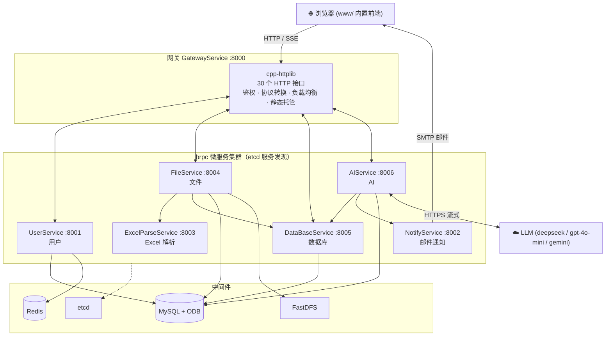
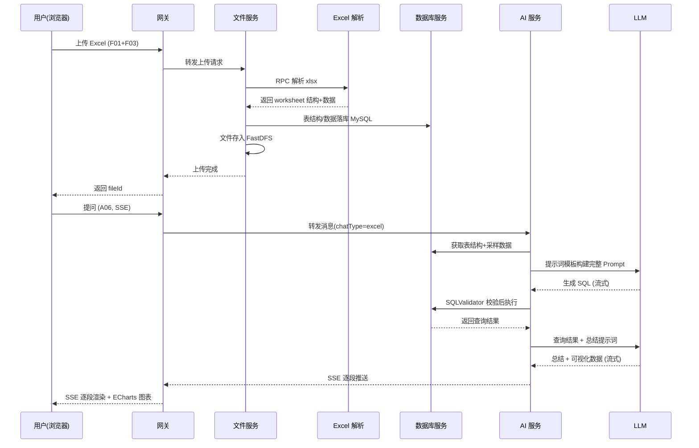

# ChatExcel 架构设计

> 本文档描述 chat-excel 的服务拆分、模块职责、内部数据流与关键技术决策，是 [README](../README.md) 架构一节的展开。

## 1. 总体架构

chat-excel 采用微服务架构，按业务职责拆分为 **7 个子服务**，统一由网关对外暴露 HTTP 接口，服务间通过 brpc + protobuf 通信，依托 etcd 实现服务注册与发现。

## 2. 子服务职责

### 2.1 网关子服务（svc_gateway_service）

前端唯一入口，基于 cpp-httplib 搭建 HTTP 服务器，实现 30 个 HTTP 接口。

- **鉴权**：调用用户子服务 `ValidSession` RPC 校验 sessionId，并透传会话所属 userId；
- **协议转换**：JSON（HTTP）↔ protobuf（RPC）双向转换，统一响应信封；
- **负载均衡**：通过 cpp-toolkit 的 ChannelManager 管理各子服务 brpc 信道（轮询策略）；
- **服务发现**：启动时向 etcd 订阅用户 / 文件 / 数据库 / AI 四个子服务的上线与下线事件；
- **静态托管**：挂载 `www/` 目录，直接提供 Web 前端页面；
- **SSE 透传**：AI 流式响应逐段转发给浏览器。

### 2.2 用户子服务（svc_user_service）

用户信息管理 + 登录态维护。

- 功能：昵称 / 邮箱唯一性校验、注册、密码登录、验证码登录、会话登录、退出登录、获取用户信息；
- **验证码**：生成 6 位数字验证码存入 Redis（带 TTL），配对 codeId 供注册 / 登录校验；
- **缓存策略**：用户信息采用 Cache-Aside 旁路缓存（MySQL 为主，Redis 加速）；
- **会话管理**：SessionData 持久化到 MySQL，支持 sessionId 恢复登录态。

### 2.3 文件子服务（svc_file_service）

文件全生命周期管理。

- 功能：文件元数据登记、二进制上传 / 下载 / 删除、文件列表、Excel 分页预览、SQLite 文件上传、文件 ↔ 聊天会话映射；
- 上传流程分两步：先 `upload/info` 登记元数据获取 fileId，再 `upload` 传输二进制（`application/octet-stream`）；
- Excel 文件由 Excel 解析子服务解析后，表结构 / 数据经数据库子服务落库 MySQL，文件本体存入 FastDFS；
- 支持上传去重，防止重复文件记录。

### 2.4 Excel 解析子服务（svc_excel_parse_service）

内部子服务（不与网关直接交互），专为文件子服务提供解析能力。

- 基于 OpenXLSX 解析 xlsx 文件的全部 worksheet；
- 提取每个 worksheet 的表结构（列名）与表数据，返回给文件子服务。

### 2.5 数据库子服务（svc_database_service）

统一的数据源接入层，内置 MySQL / SQLite 双驱动。

- 功能：新建 / 断开数据库连接、获取表列表、获取表结构 + 数据、查询连接状态；
- **驱动抽象**：`DatabaseDriver` 接口 + `MySqlDatabaseDriver` / `SqliteDatabaseDriver` 实现，上层无感切换数据源；
- **SQL 安全**：`SQLValidator` 提供 SQL 注入防护、危险操作检测、多语句拦截、只读 / 修改类型判定；
- **临时表机制**：修改类 SQL 不直接操作原表，先复制临时表（如 `users` → `users_temp`）再执行修改，保护原始数据；
- 启动时建立默认 MySQL 连接 `excel_default`，专用于智能 Excel 场景。

### 2.6 AI 子服务（svc_ai_service）

LLM 交互与聊天会话管理。

- 功能：模型列表、新建会话、会话列表、历史消息、删除会话、流式发送消息；
- **会话管理**：ChatSessionManager 管理用户 ↔ 会话绑定关系（MySQL 持久化）；
- **消息处理**：AiMessageHandler 基于 ChatSDK 与 LLM 交互，支持流式回调；
- **提示词模板**：`prompt_template/` 下的 analyze / summary / email 模板，运行时注入表结构、采样数据、数据库类型与用户问题；
- **模型接入**：通过 gflags `chat_sdk_models` 注入模型 JSON 配置（model_type / apikey / end_point 等），支持 deepseek、gpt-4o-mini、gemini 等，无需改码扩展。

### 2.7 邮件通知子服务（svc_email_notify_service）

- 功能：发送注册 / 登录验证码邮件、发送 AI 分析结果邮件；
- **线程池**：EmailWorkers 异步发送，不阻塞业务线程；
- SMTP 配置通过环境变量注入，支持 QQ / 163 邮箱。

## 3. 核心数据流

### 3.1 智能 Excel 场景

### 3.2 数据库助手场景

1. 用户上传 SQLite 文件（F09）或提交 MySQL 连接信息（D01）；
2. 数据库服务建立连接，返回 connectionId；
3. 用户浏览表列表（D03）与表数据（D04）；
4. 提问时（A06，chatType=database，携带 dbConnectId / tableName）；
5. AI 服务取表结构 + 采样数据构建 Prompt，LLM 生成 SQL；
6. SQL 经校验后由数据库服务执行，结果回传 LLM 总结，SSE 流式返回。

## 4. 关键技术决策

| 决策 | 说明 |
| --- | --- |
| **两阶段 LLM 调用** | 先让 LLM 生成 SQL（analyze_prompt，四阶段结构化输出），执行后再让 LLM 基于结果生成总结与可视化（summary_prompt），保证分析过程可追溯 |
| **结构化输出协议** | 提示词约定 `<TITLE_START>` / `<TASKS_START>` / `<ANALYSIS_START>` / `<SQL_START>` 标签，后端按标签解析，前端逐项打勾展示分析过程 |
| **修改走临时表** | 修改类 SQL 在复制的临时表上执行，原始数据零风险，连接状态接口可查询临时表与修改标记 |
| **配置与代码分离** | 全部参数经 gflags 定义，容器启动时 entrypoint.sh 用 envsubst 将环境变量渲染进 `chat_data.conf`，一套镜像跑全部子服务 |
| **构建产物聚合** | CMake 将可执行文件、动态库、prompt 模板统一聚合到 `build/bin/`，dockerfile 从该目录整体拷贝，无需额外打包脚本 |
| **SSE 而非 WebSocket** | 流式响应用 Server-Sent Events 实现单向推送，网关透传简单，前端 EventSource/fetch 均可消费 |

## 5. 代码分层约定

每个子服务遵循统一四层结构（以 AI 子服务为例）：

| 层 | 文件 | 职责 |
| --- | --- | --- |
| 入口层 | `main.cc` | gflags 解析、日志初始化、信号处理、构建器启动 |
| 服务器层 | `*_server.h/cc` | brpc 服务器构建器（服务注册、信道管理装配） |
| RPC 实现层 | `*_service_impl.h/cc` | protobuf 接口实现、协议转换 |
| 业务层 | `*_business.h/cc` | 核心业务逻辑 |
| 数据层 | `data/*_data.h/cc` | ODB 实体 + 数据访问对象（公共 `data/` 目录） |

## 6. 相关文档

- [API 接口文档](./API.md) —— 30 个 HTTP 接口完整规范
- [README](../README.md) —— 快速开始与部署
- `prompt/` 目录 —— 开发过程中的提示词与设计记录（历史存档）
